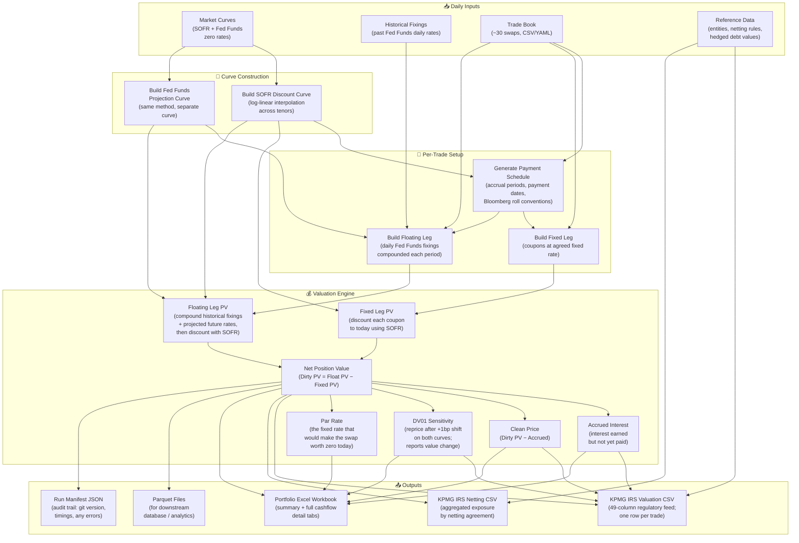
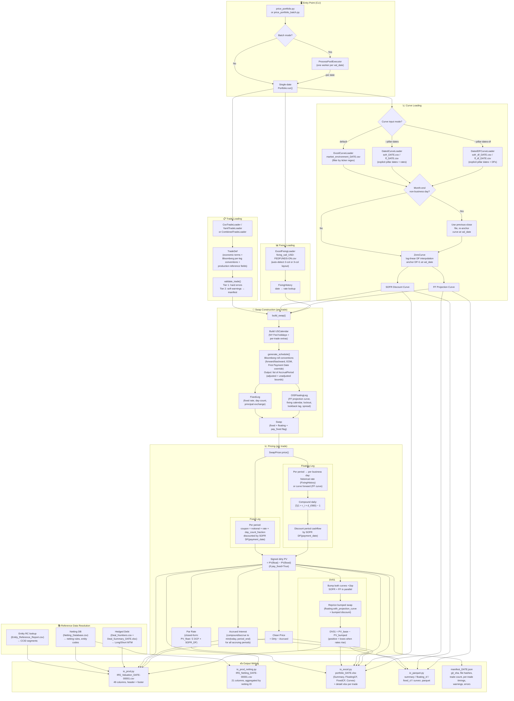

# Swap Pricer — Flow Diagrams

---

## Diagram 1 — Mid-Level Overview (stakeholder view)

```mermaid
flowchart TD
    subgraph INPUTS["📥 Daily Inputs"]
        A1["Market Curves\n(SOFR + Fed Funds\nzero rates)"]
        A2["Historical Fixings\n(past Fed Funds daily rates)"]
        A3["Trade Book\n(~30 swaps, CSV/YAML)"]
        A4["Reference Data\n(entities, netting rules,\nhedged debt values)"]
    end

    subgraph BOOTSTRAP["📐 Curve Construction"]
        B1["Build SOFR Discount Curve\n(log-linear interpolation\nacross tenors)"]
        B2["Build Fed Funds\nProjection Curve\n(same method, separate curve)"]
    end

    subgraph SCHEDULE["📅 Per-Trade Setup"]
        C1["Generate Payment Schedule\n(accrual periods, payment dates,\nBloomberg roll conventions)"]
        C2["Build Fixed Leg\n(coupons at agreed fixed rate)"]
        C3["Build Floating Leg\n(daily Fed Funds fixings\ncompounded each period)"]
    end

    subgraph PRICING["💰 Valuation Engine"]
        D1["Fixed Leg PV\n(discount each coupon\nto today using SOFR)"]
        D2["Floating Leg PV\n(compound historical fixings\n+ projected future rates,\nthen discount with SOFR)"]
        D3["Net Position Value\n(Dirty PV = Float PV − Fixed PV)"]
        D4["Accrued Interest\n(interest earned\nbut not yet paid)"]
        D5["Clean Price\n(Dirty PV − Accrued)"]
        D6["DV01 Sensitivity\n(reprice after +1bp shift\non both curves;\nreports value change)"]
        D7["Par Rate\n(the fixed rate that\nwould make the swap worth zero today)"]
    end

    subgraph OUTPUTS["📤 Outputs"]
        E1["KPMG IRS Valuation CSV\n(49-column regulatory feed;\none row per trade)"]
        E2["KPMG IRS Netting CSV\n(aggregated exposure\nby netting agreement)"]
        E3["Portfolio Excel Workbook\n(summary + full cashflow\ndetail tabs)"]
        E4["Parquet Files\n(for downstream\ndatabase / analytics)"]
        E5["Run Manifest JSON\n(audit trail: git version,\ntimings, any errors)"]
    end

    A1 --> B1
    A1 --> B2
    A2 --> C3
    A3 --> C1
    A3 --> C2
    A3 --> C3
    A4 --> E1
    A4 --> E2

    B1 --> C1
    B1 --> D1
    B1 --> D2
    B2 --> C3
    B2 --> D2

    C1 --> C2
    C1 --> C3
    C2 --> D1
    C3 --> D2

    D1 --> D3
    D2 --> D3
    D3 --> D4
    D3 --> D5
    D3 --> D6
    D3 --> D7

    D3 --> E1
    D4 --> E1
    D5 --> E1
    D6 --> E1
    D3 --> E2
    D3 --> E3
    D4 --> E3
    D5 --> E3
    D6 --> E3
    D7 --> E3
    D3 --> E4
    D3 --> E5
```

---

## Diagram 2 — Detailed Technical Flow

```mermaid
flowchart TD
    subgraph CLI["🖥️ Entry Point (CLI)"]
        Z1["price_portfolio.py\nor price_portfolio_batch.py"]
        Z2{"Batch mode?"}
        Z3["ProcessPoolExecutor\n(one worker per val_date)"]
        Z4["Single-date\nPortfolio.run()"]
    end

    subgraph LOAD_CURVES["📈 Curve Loading"]
        L1{"Curve input mode?"}
        L2["ExcelCurveLoader\nmarket_environment_DATE.csv\n(filter by ticker regex)"]
        L3["DatedCurveLoader\nsofr_DATE.csv / ff_DATE.csv\n(explicit pillar dates + rates)"]
        L4["DatedDFCurveLoader\nsofr_df_DATE.csv / ff_df_DATE.csv\n(explicit pillar dates + DFs)"]
        L5{"Month-end\nnon-business day?"}
        L6["Use previous-close\nfile, re-anchor\ncurve at val_date"]
        L7["ZeroCurve\nlog-linear DF interpolation\nanchor DF=1 at val_date"]
        L8["SOFR Discount Curve"]
        L9["FF Projection Curve"]
    end

    subgraph LOAD_FIX["📊 Fixing Loading"]
        F1["ExcelFixingLoader\nfixing_cail_USD-FEDFUNDS-ON.csv\n(auto-detect 2-col or 3-col layout)"]
        F2["FixingHistory\ndate → rate lookup"]
    end

    subgraph LOAD_TRADES["📋 Trade Loading"]
        T1["CsvTradeLoader / YamlTradeLoader\nor CombinedTradeLoader"]
        T2["TradeDef\n(economic terms +\nBloomberg per-leg conventions +\nproduction reference fields)"]
        T3["validate_trade()\nTier 1: hard errors\nTier 2: soft warnings → manifest"]
    end

    subgraph BUILD["🔧 Swap Construction (per trade)"]
        B1["build_swap()"]
        B2["Build USCalendar\n(NY Fed holidays +\nper-trade extras)"]
        B3["generate_schedule()\nBloomberg roll conventions\n(forward/backward, EOM,\nFirst Payment Date override)\nOutput: list of AccrualPeriod\n(adjusted + unadjusted bounds)"]
        B4["FixedLeg\n(fixed rate, day-count,\nprincipal exchange)"]
        B5["OISFloatingLeg\n(FF projection curve,\nfixing calendar, lockout,\nlookback lag, spread)"]
        B6["Swap\n(fixed + floating + pay_fixed flag)"]
    end

    subgraph PRICE["💹 Pricing (per trade)"]
        P1["SwapPricer.price()"]

        subgraph FIXED_PV["Fixed Leg"]
            P2["Per period:\ncoupon = notional × rate × day_count_fraction\ndiscounted by SOFR DF(payment_date)"]
        end

        subgraph FLOAT_PV["Floating Leg"]
            P3["Per period → per business day:\nhistorical rate (FixingHistory)\nor curve forward (FF curve)"]
            P4["Compound daily:\n∏(1 + r_i × d_i/360) − 1"]
            P5["Discount period cashflow\nby SOFR DF(payment_date)"]
        end

        P6["Signed dirty PV\n= PV(float) − PV(fixed)\n(if pay_fixed=True)"]
        P7["Accrued Interest\n(compound/accrue to min(today, period_end)\nfor all accruing periods)"]
        P8["Clean Price\n= Dirty − Accrued"]
        P9["Par Rate\n(closed-form:\nPV_float / Σ DCF × SOFR_DF)"]

        subgraph DV01_CALC["DV01"]
            P10["Bump both curves +1bp\nSOFR + FF in parallel"]
            P11["Reprice bumped swap\n(floating.with_projection_curve\n+ bumped discount)"]
            P12["DV01 = PV_base − PV_bumped\n(positive = loses when rates rise)"]
        end
    end

    subgraph REF["📚 Reference Data Resolution"]
        R1["Entity RC lookup\n(Entity_Reference_Report.csv)\n→ CCID segments"]
        R2["Netting DB\n(Netting_Database.csv)\n→ netting rules, entity codes"]
        R3["Hedged Debt\n(Deal_Numbers.csv +\nDeal_Summary_DATE.xlsx)\n→ Long/Short MTM"]
    end

    subgraph WRITE["✍️ Output Writing"]
        W1["io_prod.py\nIRS_Valuation_DATE-00001.csv\n49 columns, header + footer"]
        W2["io_prod_netting.py\nIRS_Netting_DATE-00001.csv\n21 columns, aggregated by netting ID"]
        W3["io_excel.py\nportfolio_DATE.xlsx\n(Summary, FloatingCF, FixedCF, Curves)\n+ detail/<trade>.xlsx per trade"]
        W4["io_parquet.py\nsummary / floating_cf /\nfixed_cf / curves .parquet"]
        W5["manifest_DATE.json\ngit_sha, file hashes,\ntrade count, per-trade timings,\nwarnings, errors"]
    end

    Z1 --> Z2
    Z2 -->|"Yes"| Z3
    Z2 -->|"No"| Z4
    Z3 -->|"per date"| Z4

    Z4 --> L1
    L1 -->|"default"| L2
    L1 -->|"--pillar-dates"| L3
    L1 -->|"--pillar-dates-df"| L4
    L2 --> L5
    L3 --> L5
    L4 --> L5
    L5 -->|"Yes"| L6
    L5 -->|"No"| L7
    L6 --> L7
    L7 --> L8
    L7 --> L9

    Z4 --> F1
    F1 --> F2

    Z4 --> T1
    T1 --> T2
    T2 --> T3

    T3 --> B1
    L8 --> B1
    L9 --> B1
    F2 --> B1

    B1 --> B2
    B2 --> B3
    B3 --> B4
    B3 --> B5
    B4 --> B6
    B5 --> B6

    B6 --> P1
    P1 --> P2
    P1 --> P3
    P3 --> P4
    P4 --> P5
    P2 --> P6
    P5 --> P6
    P6 --> P7
    P6 --> P8
    P6 --> P9
    P6 --> P10
    P10 --> P11
    P11 --> P12

    R1 --> W1
    R2 --> W1
    R2 --> W2
    R3 --> W1

    P6 --> W1
    P7 --> W1
    P8 --> W1
    P9 --> W3
    P12 --> W1
    P12 --> W3

    P6 --> W2
    P6 --> W3
    P6 --> W4
    P6 --> W5
    P12 --> W4
    P7 --> W3
    P8 --> W3

    L8 --> W3
    L9 --> W3
    L8 --> W4
    L9 --> W4
```
