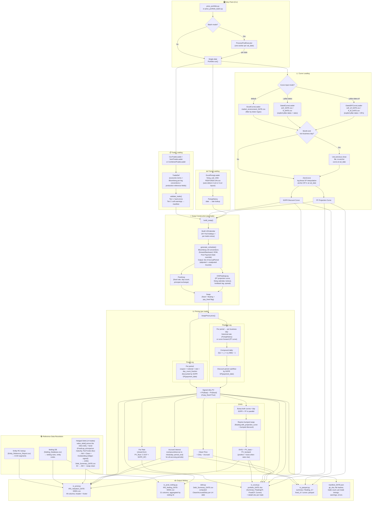

# Swap Pricer — Flow Diagrams

---

## Diagram 1 — Mid-Level Overview with Mathematical Intuition

```mermaid
flowchart TD
    subgraph INPUTS["📥 Daily Inputs"]
        A1["Market Curves\nSOFR + Fed Funds zero rates\nat standard tenors: ON, 1W, 1M … 30Y"]
        A2["Historical Fixings\nActual past Fed Funds daily rates\n(published by NY Fed each morning)"]
        A3["Trade Book  (~30 swaps)\nNotional, fixed rate, start/maturity,\nday-count, payment conventions"]
        A4["Reference Data\nEntities, netting agreements.\nHedged-debt terms are inline on each\nLH trade (debt_* block) — valued here,\nnot supplied as fair values"]
    end

    subgraph BOOTSTRAP["📐 Curve Bootstrap  (done separately for SOFR and Fed Funds)"]
        B1["Zero Rate → Discount Factor\nDF(T) = e^(−r × days/360)\nIntuition: a zero rate r tells us what $1\npromised at time T is worth today.\nHigher rates = steeper discount = lower DF"]
        B2["Fill gaps between tenors\nvia Log-Linear Interpolation:\nlog(DF) is linear between known pillars\nIntuition: forward rates stay smooth and\npositive between any two quoted tenors —\nno jagged jumps when moving across the curve"]
        B3["Extract Implied Forward Rates\nfor any future interval t1 → t2:\nF(t1,t2) = [DF(t1)/DF(t2) − 1] × 360/days\nIntuition: the ratio of two DFs tells you\nhow much $1 grows from t1 to t2;\nannualising gives the per-year rate"]
    end

    subgraph SCHEDULE["📅 Payment Schedule Generation  (per trade)"]
        C1["Roll out accrual periods\nfrom effective date to maturity\nusing Bloomberg conventions\n(forward or backward generation,\nmonth-end snapping, stub handling)\nOutput: list of period start / end /\npayment dates for each coupon"]
    end

    subgraph FIXED["🔒 Fixed Leg  —  Straightforward Discounting"]
        D1["Coupon per period i:\nCF_i = Notional × FixedRate × (days_i / 360)\nJust rate × time × notional.\nEvery coupon is known at trade inception"]
        D2["Present Value:\nPV_fixed = Σ CF_i × DF_SOFR(payment_date_i)\nDiscount each certain future payment\nback to today using the SOFR curve"]
    end

    subgraph FLOATING["🌊 Floating Leg  —  Daily Compounding in Arrears"]
        E1["Assemble daily rates for each period:\n• Past business days → actual fixing from history\n• Future business days → forward rate F(day, day+1)\n• Friday carries 3 days weight (covers weekend)\nLockout: last N fixings frozen at rate\nfrom N+1 business days before period end"]
        E2["Compound overnight rates within the period:\ngrowth = ∏ (1 + r_i × d_i / 360)\nIntuition: imagine rolling $1 overnight every\nbusiness day and reinvesting the interest.\nAfter all business days, growth−1 is the\ntotal return for the whole accrual period"]
        E3["Period cashflow:\nCF = Notional × (growth − 1)\n= total interest earned on the notional\nby compounding every overnight fixing"]
        E4["Present Value:\nPV_floating = Σ CF_i × DF_SOFR(payment_date_i)\nSame SOFR discounting as the fixed leg"]
    end

    subgraph NETPV["⚖️ Net Swap Value"]
        F1["Dirty PV  (paying fixed):\nDirty = PV_floating − PV_fixed\nThe full economic value of the swap today,\nincluding interest that has accrued\nbut not yet been paid"]
        F2["Accrued Interest:\nInterest earned in the current\naccrual period up to today —\ncompound fixings from period start to today\n(floating) or rate × elapsed days (fixed).\nThis money is 'owed' but will only\nbe exchanged on the next payment date"]
        F3["Clean Price:\nClean = Dirty − Accrued\nStrips out the accrual build-up so that\ntwo trades can be fairly compared\nregardless of where we are\nin the coupon period"]
    end

    subgraph ANALYTICS["📊 Risk Metrics"]
        G1["Par Rate  (break-even fixed rate):\ns* = PV_floating / Annuity\nAnnuity = Σ (days_i/360) × DF_SOFR(pay_i)\nIntuition: if we replaced the agreed fixed rate\nwith s*, the swap would be worth exactly zero.\nrate_diff_bp = (FixedRate − s*) × 10,000\ntells you how far off-market the trade is"]
        G2["DV01  (dollar sensitivity to rates):\n1. Shift every pillar on both SOFR and FF\n   curves up by exactly 1bp (0.01%)\n2. All DFs fall slightly → future cashflows\n   are worth a little less\n3. DV01 = PV_before − PV_after\nIntuition: how many dollars does the position\ngain or lose for a 1bp rise in all rates?\nPositive DV01 = position loses when rates rise\n(typical for a receive-fixed swap)"]
    end

    subgraph OUTPUTS["📤 Outputs"]
        H1["KPMG IRS Valuation CSV\n49-column regulatory feed\nOne row per trade: clean, dirty,\naccrued, DV01, CCID codes"]
        H2["KPMG IRS Netting CSV\nAggregated exposure per netting group:\nGross DA / DL → Net DA / DL\nafter applying position netting rules"]
        H3["Portfolio Excel Workbook\nSummary tab + full cashflow detail\n(one row per daily fixing on floating leg)"]
        H4["Parquet + Manifest\nDatabase-ready files and\naudit trail with git SHA,\ntimings, and any errors"]
    end

    A1 --> B1
    B1 --> B2
    B2 --> B3

    A3 --> C1

    B3 --> E1
    A2 --> E1
    C1 --> D1
    C1 --> E1

    D1 --> D2
    E1 --> E2
    E2 --> E3
    E3 --> E4

    B2 --> D2
    B2 --> E4

    D2 --> F1
    E4 --> F1
    F1 --> F2
    F2 --> F3

    F1 --> G1
    F1 --> G2

    A4 --> H1
    A4 --> H2
    F1 --> H1
    F2 --> H1
    F3 --> H1
    G2 --> H1
    F1 --> H2
    F1 --> H3
    F2 --> H3
    F3 --> H3
    G1 --> H3
    G2 --> H3
    F1 --> H4
```

---

## Diagram 2 — Detailed Technical Flow

```mermaid
flowchart TD
    subgraph CLI["🖥️ Entry Point (CLI)"]
        Z1["price_portfolio.py\nor price_portfolio_batch.py"]
        Z2{"Batch mode?"}
        Z3["ProcessPoolExecutor\n(one worker per val_date)"]
        Z4["Single-date\nPortfolio.run()"]
    end

    subgraph LOAD_CURVES["📈 Curve Loading"]
        L1{"Curve input mode?"}
        L2["ExcelCurveLoader\nmarket_environment_DATE.csv\n(filter by ticker regex)"]
        L3["DatedCurveLoader\nsofr_DATE.csv / ff_DATE.csv\n(explicit pillar dates + rates)"]
        L4["DatedDFCurveLoader\nsofr_df_DATE.csv / ff_df_DATE.csv\n(explicit pillar dates + DFs)"]
        L5{"Month-end\nnon-business day?"}
        L6["Use previous-close\nfile, re-anchor\ncurve at val_date"]
        L7["ZeroCurve\nlog-linear DF interpolation\nanchor DF=1 at val_date"]
        L8["SOFR Discount Curve"]
        L9["FF Projection Curve"]
    end

    subgraph LOAD_FIX["📊 Fixing Loading"]
        F1["ExcelFixingLoader\nfixing_cail_USD-FEDFUNDS-ON.csv\n(auto-detect 2-col or 3-col layout)"]
        F2["FixingHistory\ndate → rate lookup"]
    end

    subgraph LOAD_TRADES["📋 Trade Loading"]
        T1["CsvTradeLoader / YamlTradeLoader\nor CombinedTradeLoader"]
        T2["TradeDef\n(economic terms +\nBloomberg per-leg conventions +\nproduction reference fields)"]
        T3["validate_trade()\nTier 1: hard errors\nTier 2: soft warnings → manifest"]
    end

    subgraph BUILD["🔧 Swap Construction (per trade)"]
        B1["build_swap()"]
        B2["Build USCalendar\n(NY Fed holidays +\nper-trade extras)"]
        B3["generate_schedule()\nBloomberg roll conventions\n(forward/backward, EOM,\nFirst Payment Date override)\nOutput: list of AccrualPeriod\n(adjusted + unadjusted bounds)"]
        B4["FixedLeg\n(fixed rate, day-count,\nprincipal exchange)"]
        B5["OISFloatingLeg\n(FF projection curve,\nfixing calendar, lockout,\nlookback lag, spread)"]
        B6["Swap\n(fixed + floating + pay_fixed flag)"]
    end

    subgraph PRICE["💹 Pricing (per trade)"]
        P1["SwapPricer.price()"]

        subgraph FIXED_PV["Fixed Leg"]
            P2["Per period:\ncoupon = notional × rate × day_count_fraction\ndiscounted by SOFR DF(payment_date)"]
        end

        subgraph FLOAT_PV["Floating Leg"]
            P3["Per period → per business day:\nhistorical rate (FixingHistory)\nor curve forward (FF curve)"]
            P4["Compound daily:\n∏(1 + r_i × d_i/360) − 1"]
            P5["Discount period cashflow\nby SOFR DF(payment_date)"]
        end

        P6["Signed dirty PV\n= PV(float) − PV(fixed)\n(if pay_fixed=True)"]
        P7["Accrued Interest\n(compound/accrue to min(today, period_end)\nfor all accruing periods)"]
        P8["Clean Price\n= Dirty − Accrued"]
        P9["Par Rate\n(closed-form:\nPV_float / Σ DCF × SOFR_DF)"]

        subgraph DV01_CALC["DV01"]
            P10["Bump both curves +1bp\nSOFR + FF in parallel"]
            P11["Reprice bumped swap\n(floating.with_projection_curve\n+ bumped discount)"]
            P12["DV01 = PV_base − PV_bumped\n(positive = loses when rates rise)"]
        end
    end

    subgraph REF["📚 Reference Data Resolution"]
        R1["Entity RC lookup\n(Entity_Reference_Report.csv)\n→ CCID segments"]
        R2["Netting DB\n(Netting_Database.csv)\n→ netting rules, entity codes"]
        R3["Hedged Debt (LH trades)\nvalue_debt() prices the inline debt_* bond\n(FixedLeg, principal-at-maturity, Fed Funds disc)\n→ AW = Clean + Outstanding (obligor-signed)\n→ writes Debt_Summary_DATE.csv\nSC → AW = −swap clean"]
    end

    subgraph WRITE["✍️ Output Writing"]
        W1["io_prod.py\nIRS_Valuation_DATE-00001.csv\n49 columns, header + footer"]
        W2["io_prod_netting.py\nIRS_Netting_DATE-00001.csv\n21 columns, aggregated by netting ID"]
        W2b["debt.py\nDebt_Summary_DATE.csv\ncomputed Clean/Accrued/Dirty per LH debt"]
        W3["io_excel.py\nportfolio_DATE.xlsx\n(Summary, FloatingCF, FixedCF, Curves)\n+ detail/<trade>.xlsx per trade"]
        W4["io_parquet.py\nsummary / floating_cf /\nfixed_cf / curves .parquet"]
        W5["manifest_DATE.json\ngit_sha, file hashes,\ntrade count, per-trade timings,\nwarnings, errors"]
    end

    Z1 --> Z2
    Z2 -->|"Yes"| Z3
    Z2 -->|"No"| Z4
    Z3 -->|"per date"| Z4

    Z4 --> L1
    L1 -->|"default"| L2
    L1 -->|"--pillar-dates"| L3
    L1 -->|"--pillar-dates-df"| L4
    L2 --> L5
    L3 --> L5
    L4 --> L5
    L5 -->|"Yes"| L6
    L5 -->|"No"| L7
    L6 --> L7
    L7 --> L8
    L7 --> L9

    Z4 --> F1
    F1 --> F2

    Z4 --> T1
    T1 --> T2
    T2 --> T3

    T3 --> B1
    L8 --> B1
    L9 --> B1
    F2 --> B1

    B1 --> B2
    B2 --> B3
    B3 --> B4
    B3 --> B5
    B4 --> B6
    B5 --> B6

    B6 --> P1
    P1 --> P2
    P1 --> P3
    P3 --> P4
    P4 --> P5
    P2 --> P6
    P5 --> P6
    P6 --> P7
    P6 --> P8
    P6 --> P9
    P6 --> P10
    P10 --> P11
    P11 --> P12

    R1 --> W1
    R2 --> W1
    R2 --> W2
    R3 --> W1

    P6 --> W1
    P7 --> W1
    P8 --> W1
    P9 --> W3
    P12 --> W1
    P12 --> W3

    P6 --> W2
    P6 --> W3
    P6 --> W4
    P6 --> W5
    P12 --> W4
    P7 --> W3
    P8 --> W3

    L8 --> W3
    L9 --> W3
    L8 --> W4
    L9 --> W4
```
